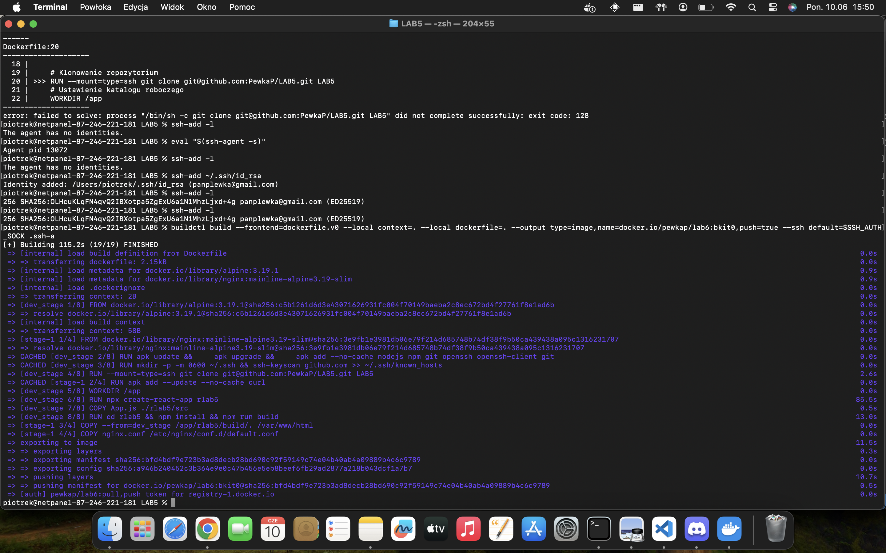

Obraz zbudowany przy pomocy polecenia

buildctl build --frontend=dockerfile.v0 --local context=. --local dockerfile=. --output type=image,name=docker.io/pewkap/lab6:bkit0,push=true --ssh default=$SSH_AUTH_SOCK .ssh-a

buildctl build --frontend=dockerfile.v0 --local context=. --local dockerfile=. --output type=image,name=docker.io/pewkap/lab6:lab6,push=true --ssh default=$SSH_AUTH_SOCK .ssh-a
